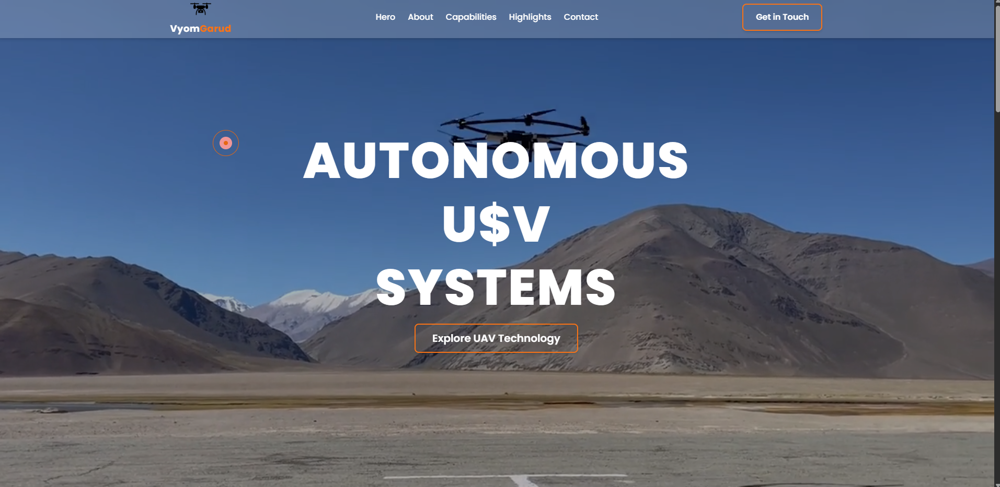

# 🚁 VyomGarud – UAV Systems Landing Page  
**Web Developer Intern Assessment – 48 Hour Assignment**

A modern, dark-themed, futuristic landing page built for **VyomGarud**, a UAV / autonomous drone systems company.  
This project showcases precision, military-grade aesthetic, subtle animations, responsive design, and clean component structure.

---

## 📸 Screenshots


### 🖼️ **Hero**



---

## 🌐 Live Demo  
👉 *https://profound-melomakarona-132cb9.netlify.app/*  
Otherwise ignore this section.

---

## 🎯 Project Overview

This landing page was built as part of the **VyomGarud Web Developer Internship Assessment**.  
The goal was to create a single-page, visually polished, responsive, professional-grade website using React + Tailwind.

The website includes:

- ⚫ Military-grade dark modern UI  
- 🚀 Background video hero section  
- 🎯 Animated blinking text effect  
- 🛰 Overlapping scroll animations  
- ✨ Glassmorphism cards  
- 📌 Scroll-based smooth navigation  
- 🎥 Drone visuals and motion effects  
- 🧲 Custom cursor tracking  
- 📩 Contact form + social icons  

---

## ✅ **Features Completed**

### 🔹 **1. Navbar**
- Fixed top navigation  
- Smooth scrolling  
- Mobile hamburger menu  
- Company logo with branding  
- Glassmorphic background blur  

### 🔹 **2. Hero Section**
- Full-screen looping drone background video  
- Custom glitch/blinking text animation  
- Fade-in CTA button  
- Custom orange glow hover effect  
- Custom cursor following mouse  

### 🔹 **3. About Section**
- Clean overlapping reveal over the hero  
- Dark futuristic text style  

### 🔹 **4. Capabilities Section**
- 3 cards with icons/videos  
- Hover tilting animation  
- Responsive grid  

### 🔹 **5. Highlights Section**
- Three bullet points  
- Animated glassmorphic container  
- Subtle scroll-trigger animation  

### 🔹 **6. Contact Section / Footer**
- Modern form UI  
- Glassmorphism  
- Company logo + email  
- Social icons in animated square boxes  
- Horizontal divider  

### 🔹 **7. Technical Quality**
- Fully responsive  
- Component-based architecture  
- Tailwind CSS throughout  
- Clean folder structure  
- Framer Motion animations  

---

## 🛠️ **Tech Stack**

- **React.js**  
- **Tailwind CSS**  
- **Framer Motion** (animations)  
- **React Icons**  
- **Custom CSS**  
- **Google Fonts (Poppins)**  

---

## 📁 Folder Structure
/src
/assets
bgVideo.mp4
drone.png
...
/common
Button.jsx
Cursor.jsx
/component
Navbar.jsx
Hero.jsx
About.jsx
Capabilities.jsx
Highlights.jsx
Contact.jsx
App.js
App.css
index.css
main.jsx


---

## 🧑‍💻 **How to Run Locally**

### **1. Clone the repository**

```bash
git clone https://github.com/YOUR-USERNAME/YOUR-REPO-NAME.git
```
2. Navigate into the project folder
3. Install dependencies
```
npm install
```
4.  Run the development server
   ```
npm start
```

 Your app will open at:

👉http://localhost:3000


📦 Build for Production
npm run build


This generates optimized production files in the /build folder.


📝 Assignment Requirements (All Completed)

✔ React + Tailwind
✔ Dark + military theme
✔ Poppins / Inter / Montserrat → Using Poppins globally
✔ Hero + About + Capabilities + Highlights + Contact
✔ Subtle animations
✔ Glassmorphism
✔ Responsiveness
✔ Clean code & components
✔ Screenshots 


🏁 Conclusion

This project demonstrates:

A strong sense of UI/UX

Animation understanding

Good React component structure

Clean Tailwind usage

Creativity beyond the requirements


👤 Author

Anju
VyomGarud – Web Developer Intern Assessment
